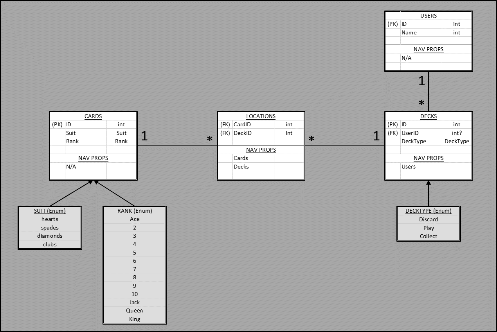

# Introduction 
[Speed War](https://speedwar.azurewebsites.net/)  
Speed War emulates the card game of the same name that pits the user (player) against the computer. It uses web sockets (SignalR) to maintain an open connection and constant client-server communication; that is, the user does not need to refresh the page to see game status updates since they are delivered and rendered real-time.  
Upon game start, the user and computer begin taking turns flipping cards from their 'play' decks into a common 'discard' deck. When the top 2 cards match in rank, the computer and player can 'slap' the 'discard' deck to claim all the cards in the pile, which are then moved to that player's 'collect' deck. The next round begins with the winner flipping the top card of their deck. Game play continues until either player 'slaps' successfully when the other player's decks are out of cards. 

## Getting Started
### Build
To build and run this page locally (using Visual Studio and SQL Server):
1. Clone the repo locally and compile it.  
2. This application uses User Secrets. Copy this into your secrets.json and replace connection string where indicated:  
    {  
      "ConnectionStrings": {  
        " <--- add your database connection string here ---> "  
      }  
    }  

3. Build the cards database using existing migration (Update-Database).
The application is ready to run via your local/live server or your chosen deployment.  

### Tests
The test suite is built in xUnit. Once the app is built as described above, all tests can be run using the 'Run All' command in the Test Explorer.  
Tests include:
- Getters and Setters of all models.
- CRUD tests of all methods in the User Service and the DeckCard Service, as well as methods in the PlayHub.

## Architecture
This Razor Pages application is centered around 2 pages - a landing page (where a user logs in and initiates a game) and a play page (where all game play occurs). In order to prevent game interruptions caused by page refresh, most of the interaction occurs in the front-end script rather than in routes in the pagemodels, and continuous updating of game state is achieved via a web socket (using SignalR). As a result, the pagemodels contain only enough routing to initiate a game.

Typical web applications are built around the 'Web Request Response Cycle', wherein a client sends a bundle of data (a 'Request' object) to the server, which acts on the request, and returns data as appropriate (a 'Response' object) which is used by the client to render new/updated content. What this means is that each client action effectively requires a pause in the activity flow in order to produce these transactions that update the content on the page. SignalR (web sockets) removes the transactional pauses in this cycle through use of a 'hub', which is a class that is directly accessible by both server and client. All methods and properties in the hub can be called and referenced directly by both sides. The hub acts as a proxy to the Controllers in a typical MVC design; that is, it allows the client to effectively serve itself, and it allows the server to serve content even when the client hasn't asked for it. Communication becomes fluid and apparently continuous instead of transactional, and that makes for a far more interactive and engaging UX design, while paving the way for behaviors that simply didn't suit the classic WRRC approach because of the need for continuity.

Game play and state variables are primarily stored and managed by the client's script, which potentially allows for multiple clients to play at once (although the current Player v Computer paradigm doesn't support that in this prototype phase) and promotes rapid response time (as compared to database-managed state variables and hub-originating play actions). The 'Computer' player acts on a delay (1500ms for 'Easy' mode, 500ms for 'Hard' mode) in order to level the table for the human player. 'Computer' actions are triggered by either 'Player' actions (ie - 'Flip') or game state changes (ie - 'Slap' after new card rendering data delivered to client for both players to 'see'). Play logic addresses automatic deck reshuffle (when a 'Play' deck is empty and needs to be replenished by that player's 'Collect' deck). Game end logic accounts for either player's 'slap' when the other player's decks are both empty, and also for all cards in the 'discard' pile after no matches having appeared (ie - stalemate). On game end, game results are displayed, and the user is offered an opportunity to play again.

Data is stored in a SQL database, and game play occurs primarily by making updates to properties in the 'DeckCards' and 'Users' tables in the database. Data structure is as follows:

- User: Users are created upon login. They a primary key of ID, and a property of name. To hold game state, they also have properties of 'FirstCard' (indicating the card currently at the top of the discard pile) and 'SecondCard' (indicating the card currently second from top of the discard pile).
- Deck: Decks are created when a new user is created. Decks contain a Primary Key of ID, and properties of UserID and Deck Type. Deck Type is an enum containing Discard, Play, and Collect.
- DeckCard: DeckCard is a join table that connects Cards and Decks. It has no properties, but has a composite key of DeckID and CardID.
- Card: Cards have a suit and a rank based on a standard deck of 52 cards, and a property containing an image location for rendering. They also have a Primary Key of ID. They exist in the database, and are readonly. Players will never create, update or delete a card.  

## Credit & Acknowledgement
This project is a collaborative effort by  
  - Clarice Costello: https://github.com/c-costello  
  - Shalom Balaineh: https://github.com/shalina2  
  - Xia Liu: https://github.com/xialiu1988  
  - Gwen Zubatch: https://github.com/GwennyB  

Third party content:  
- [SignalR](https://dotnet.microsoft.com/apps/aspnet/real-time)

