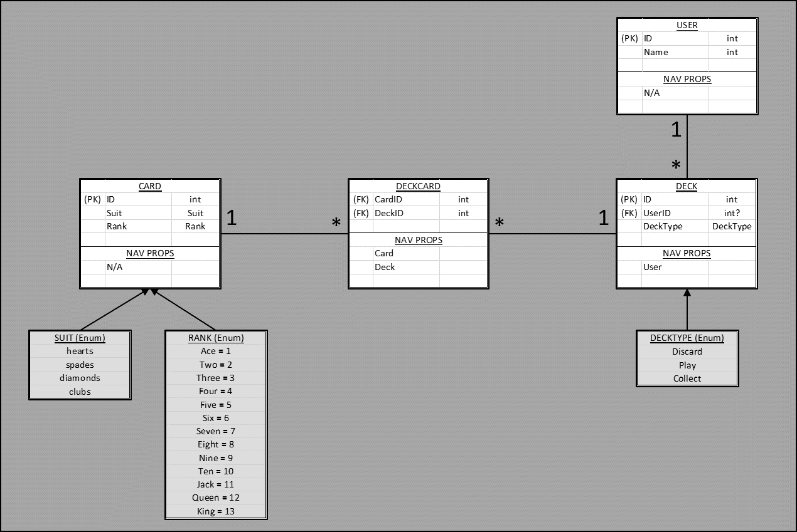

# Introduction 
Speed War emulates the card game of the same name that pits the user (player) against the computer. It uses web sockets (SignalR) to maintain an open connection and constant client-server communication; that is, the user does not need to refresh the page to see game status updates since they are delivered and rendered real-time.
Upon game start, the user and computer begin taking turns flipping cards from their play decks into a common discard pile. When the top 2 cards match in rank, the computer and player can "slap" the card pile to claim all the cards in the pile. The next round begins with the winner flipping the top card of their deck. Game play continues until either the player of the computer is out of cards. 

## Getting Started
TODO: Guide users through getting your code up and running on their own system. In this section you can talk about:
1.	Installation process
2.	Software dependencies
3.	Latest releases
4.	API references

## Build and Test
TODO: Describe and show how to build your code and run the tests. 

## Architecture

  

## Testing

## Credit & Acknowledgement
This project is a collaborative effort by  
  - Clarice Costello: https://github.com/c-costello  
  - Shalom Balaineh: https://github.com/shalina2  
  - Xia Liu: https://github.com/xialiu1988  
  - Gwen Zubatch: https://github.com/GwennyB  

## Contribute
TODO: Explain how other users and developers can contribute to make your code better. 

